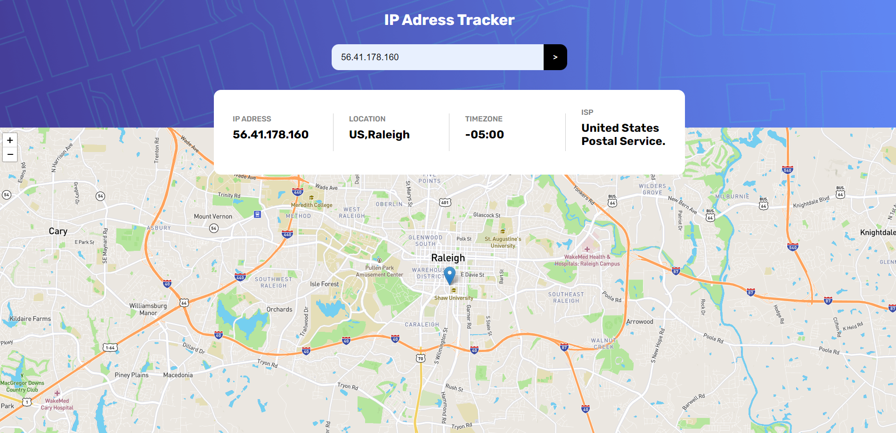

# IP Tracker

This project involves the development of an IP tracking website using core web technologies, including HTML5, vanilla CSS5, and Javascript. The primary goal is to display a map based on the geographical coordinates associated with a specific IP address.

## Key Features

### 1. Integration of Mapbox API

The site incorporates the Mapbox API to provide a dynamic cartographic experience. The obtained geographical coordinates are used to position and display the corresponding map on the site.

### 2. Usage of Geo Ipify API

We have integrated the Geo Ipify API to gather detailed information about a given IP address. This API enables us to extract relevant data such as country, region, city, and other details associated with the queried IP address.

### How it Works

Enter IP Address: Users can input an IP address in the site's interface.

Data Processing: The site uses the Geo Ipify API to retrieve information related to the provided IP address.

Map Display: The obtained geographical coordinates are then utilized to showcase the location on the map using the Mapbox API.

 

